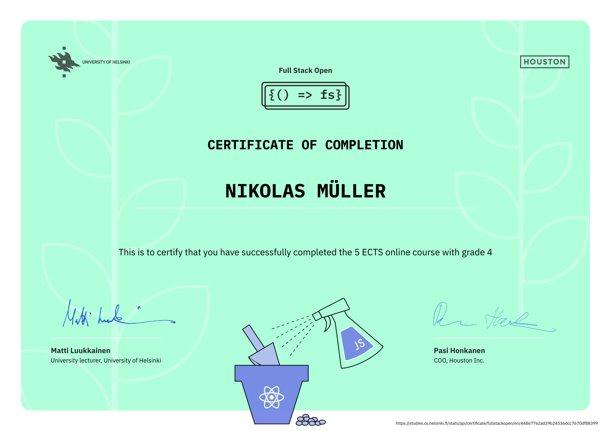

# Full Stack open

This repository contains my solutions and code developed while working through the exercises of the University of Helsinki's [Full Stack open](https://fullstackopen.com/en/) course.

## Repository Structure

The code in this repository is organized into folders, corresponding to the different parts of the course (e.g., `part0`, `part1`, `part2`, etc.). Each folder contains the exercises related to that part.

## Progress

| Part          | Status      | Exercises |
| :-----------: | :---------: | :-------: |
| [0](./part0/) | Done        | 6/6       |
| [1](./part1/) | Done        | 14/14     |
| [2](./part2/) | Done        | 20/20     |
| [3](./part3/) | Done        | 22/22     |
| [4](./part4/) | Done        | 23/23     |
| [5](./part5/) | In Progress | 0/23      |

## Course certificates

### Full Stack Open: Core (Part 0-4)

