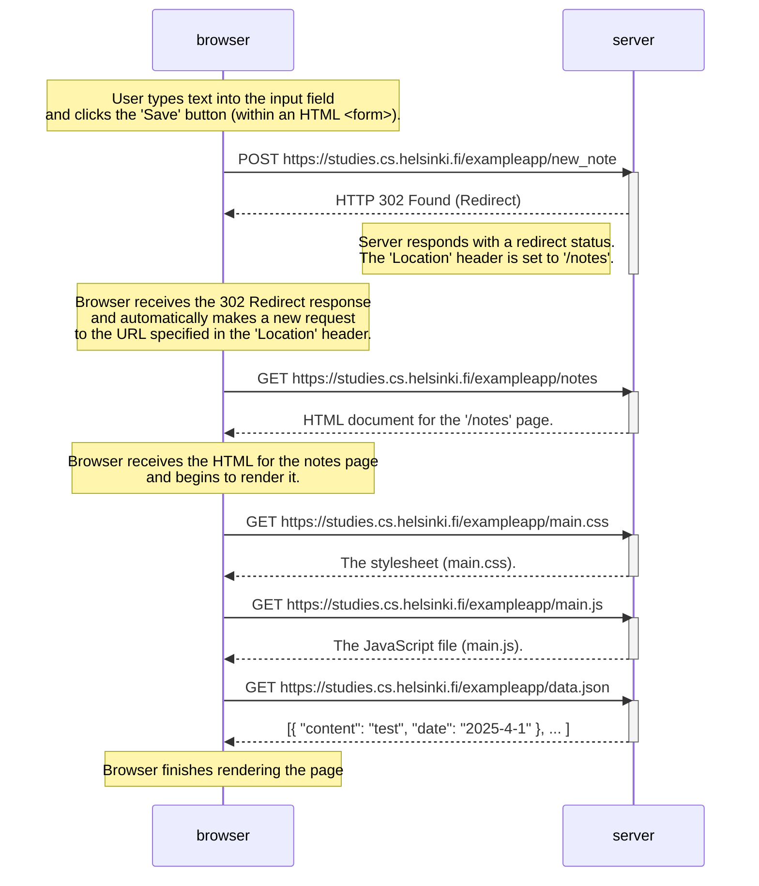

```mermaid
    sequenceDiagram
        participant browser
        participant server

        note over browser: User types text into the input field<br/>and clicks the 'Save' button (within an HTML <form>).

        browser->>server: POST https://studies.cs.helsinki.fi/exampleapp/new_note
        activate server
        server-->>browser: HTTP 302 Found (Redirect)
        note left of server: Server responds with a redirect status.<br/>The 'Location' header is set to '/notes'.
        deactivate server

        note over browser: Browser receives the 302 Redirect response<br/>and automatically makes a new request<br/>to the URL specified in the 'Location' header.

        browser->>server: GET https://studies.cs.helsinki.fi/exampleapp/notes
        activate server
        server-->>browser: HTML document for the '/notes' page.
        deactivate server

        note over browser: Browser receives the HTML for the notes page<br/>and begins to render it.

        browser->>server: GET https://studies.cs.helsinki.fi/exampleapp/main.css
        activate server
        server-->>browser: The stylesheet (main.css).
        deactivate server

        browser->>server: GET https://studies.cs.helsinki.fi/exampleapp/main.js
        activate server
        server-->>browser: The JavaScript file (main.js).
        deactivate server

        browser->>server: GET https://studies.cs.helsinki.fi/exampleapp/data.json
        activate server
        server-->>browser: [{ "content": "test", "date": "2025-4-1" }, ... ]
        deactivate server

        note over browser: Browser finishes rendering the page
```