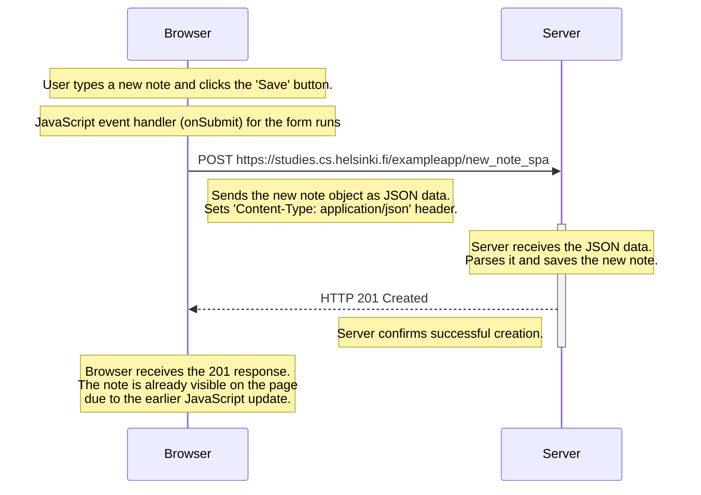

```mermaid
    sequenceDiagram
        participant browser as Browser
        participant server as Server

        note over browser: User types a new note and clicks the 'Save' button.

        note over browser: JavaScript event handler (onSubmit) for the form runs

        browser->>server: POST https://studies.cs.helsinki.fi/exampleapp/new_note_spa
        note right of browser: Sends the new note object as JSON data.<br/>Sets 'Content-Type: application/json' header.

        activate server
        note over server: Server receives the JSON data.<br/>Parses it and saves the new note.
        server-->>browser: HTTP 201 Created
        note left of server: Server confirms successful creation.
        deactivate server

        note over browser: Browser receives the 201 response.<br/>The note is already visible on the page<br/>due to the earlier JavaScript update.
```